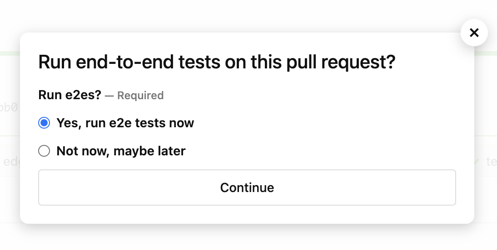

# end-to-end tests on pull requests

The Buildkite scripts/config in this folder allow us to run end-to-end (e2e) tests on pull requests.
It's moderately fiddly, so this README tries to outline the broad approach.

## Desirable properties

*   We should be able to run our full suite of end-to-end tests on pull requests before we merge to `main`.
*   These tests should run in an environment that's as similar as possible to our "real" environment -- i.e., prod.
*   These tests should be opt-in -- somebody who's making a docs or test-only change shouldn't need to wait for a complete e2e suite that we already know will pass.

## What it looks like for devs

At the end of a "build + test" job on a branch other than `main`, devs get asked whether they want to run end-to-end tests:

If you select **Yes, run e2e tests now**, we use `buildkite-agent pipeline upload` to dynamically add more steps to the pipeline. Buildkite will start running these end-to-end tests steps as part of the same "build + test" job.  
See [additional steps](pipeline.e2e-pull-requests.yml) for more details.

If you select **Not now, maybe later**, Buildkite will complete the current build, but ask you again when you push new commits.
This is useful if you know your PR is a draft or work-in-progress, and it's not worth running e2e tests yet.  

## Implementation notes

*   We only turn on the e2e cluster when we're running tests, to reduce costs.
