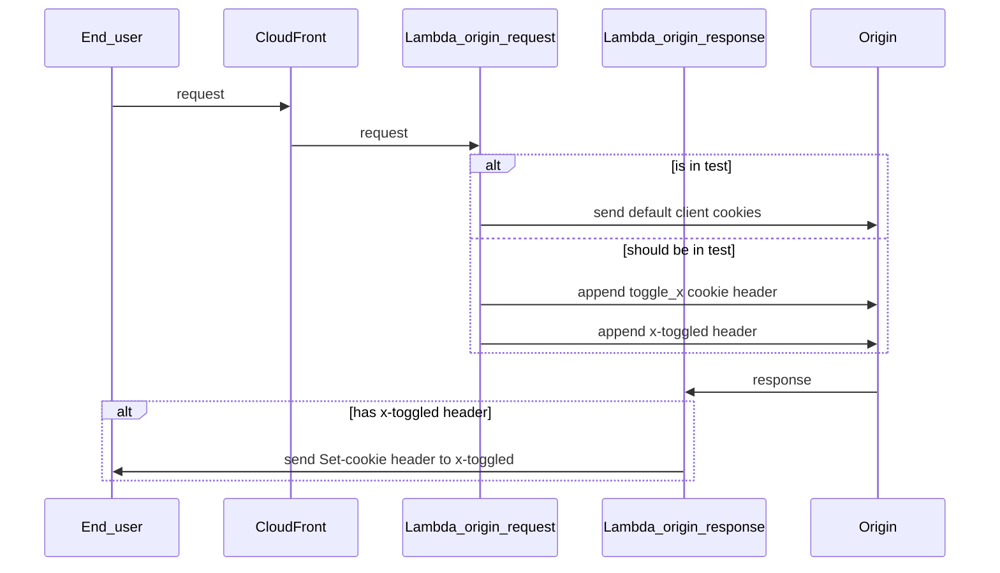

# Cache

We use CloudFront for the cache of wellcomecollection.org.

## lambda@edge

### [Redirector](./edge_lambdas/src/redirector.test.ts)

Redirects traffic at the edge, mitigating against any latency of having to route to a service.

The list is controlled via [a static map of URLs](./edge_lambdas/src/redirects.ts).

We don't control marketing URLs or alias URLs here. Marketing URLs are generally best handled with a
link shortener for tracking etc. Alias URLs, e.g. `/whats-on` are managed with the
[routing of the relevant application](https://github.com/wellcomecollection/wellcomecollection.org/blob/main/content/webapp/server.ts).

`redirector` runs @ the `origin-request` of [the lambda@edgfe lifecycle](https://docs.aws.amazon.com/lambda/latest/dg/lambda-edge.html).

#### Add a redirect

Add the source relative URL and the target in [our static map of URLs](./edge_lambdas/src/redirects.ts).

Create a PR with this change, and once merged and built, run `terraform plan` and if it looks good, `terraform apply`.

Test your redirection in staging after a few minutes. Cache might need to be cleared.

If that works, next step is to apply the changes to prod.
For that, you'll need to change the edge lambda versions in our [locals file](./locals.tf).
You can find that version number in the Lambda AWS app.

Once that has been merged and built, you'll need to reapply Terraform.

### [Toggler](./edge_lambdas/src/toggler.test.ts) (A/B testing)

Randomly assign people into A/B buckets against a `key` that is then available to our webapps.

We do this by setting a `toggle_{key}=true|false` that is then read via the standard toggles method.

The steps to create an A/B test are available in [GitBook](https://app.gitbook.com/o/-LumfFcEMKx4gYXKAZTQ/s/DPDDj27NI2F2kPukWrC1/readme/front-end/a-b-testing).

`toggler` runs @ the `origin-request` and `origin-response` of [the lambda@edgfe lifecycle](https://docs.aws.amazon.com/lambda/latest/dg/lambda-edge.html).
