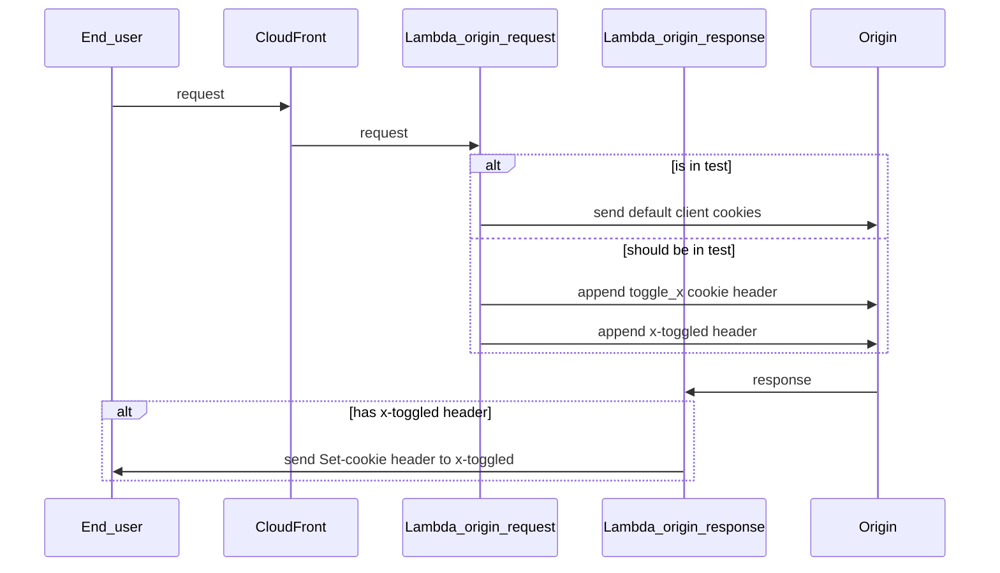

# Cache

We use CloudFront for the cache of wellcomecollection.org.

## lambda@edge

### [Redirector](./edge_lambdas/src/redirector.test.ts)

Redirects traffic at the edge, mitigating against any latency of having to route to a service.

The list is controlled via [a static map of URLs](./edge_lambdas/src/redirects.ts).

We don't control marketing URLs or alias URLs here. Marketing URLs are generally best handled with a
link shortener for tracking etc. Alias URLs, e.g. `/whats-on` are managed with the
[routing of the relevant application](https://github.com/wellcomecollection/wellcomecollection.org/blob/main/content/webapp/server.ts).

`redirector` runs @ the `origin-request` of [the lambda@edgfe lifecycle](https://docs.aws.amazon.com/lambda/latest/dg/lambda-edge.html).

#### Add a redirect

Add the source relative URL and the target in [our static map of URLs](./edge_lambdas/src/redirects.ts).

Create a PR with this change, and once merged and built, run `terraform plan` and if it looks good, `terraform apply`.

Test your redirection in staging after a few minutes. Cache might need to be cleared.

If that works, next step is to apply the changes to prod.
For that, you'll need to change the edge lambda versions in our [locals file](./locals.tf).
You can find that version number in the Lambda AWS app.

Once that has been merged and built, you'll need to reapply Terraform.

### [Toggler](./edge_lambdas/src/toggler.test.ts) (A/B testing)

Randomly assign people into A/B buckets against a `key` that is then available to our webapps.

We do this by setting a `toggle_{key}=true|false` that is then read via the standard toggles method.



`toggler` runs @ the `origin-request` and `origin-response` of [the lambda@edgfe lifecycle](https://docs.aws.amazon.com/lambda/latest/dg/lambda-edge.html).

### Steps to create an A/B test
1. Add a test object to [`toggler.ts`](https://github.com/wellcomecollection/wellcomecollection.org/blob/main/cache/edge_lambdas/src/toggler.ts) and add an equivalent test object with the same id to [`toggles.ts`](https://github.com/wellcomecollection/wellcomecollection.org/blob/main/toggles/webapp/toggles.ts)  – this second object is important because it allows us to determine [what should be sent to GA](https://github.com/wellcomecollection/wellcomecollection.org/blob/main/common/services/app/analytics-scripts/google-analytics.tsx)
```
{
  id: 'someToggleId',
  title: 'New subject tags on works pages',
  range: [0, SOME_PERCENTAGE],
  when: request => {
    return !!request.uri.match(/SOME_REGEX/);
  },
}
```
2. Update and upload the lambda deployment package. From the root of the repo, run:
```
docker compose build edge_lambdas
AWS_PROFILE=experience-developer docker compose run edge_lambdas yarn deploy
```
3. Deploy the toggle to the toggles dashboard. From the `toggles/webapp` directory, run:
```
yarn deploy
```
4. Deploy the lambda. From inside the `cache` directory, run:
```
terraform plan -out=terraform.plan
terraform apply terraform.plan
```
5. Make a note of the `edge_lambda_request_version` and `edge_lambda_response_version` numbers in the terminal resulting from the terraform command
6. Check www-stage and verify the test cookie (`toggle_someToggleId`) is set
7. Check the data is being sent to GA (either `someToggleId` or `!someToggleId`). You should initially be able to see the toggles dataLayer variable being set (`DLV - Toggles`) in GTM, then this data should get sent to GA as a custom dimension (note you might not be able to see this until the next day)
8. Update [`locals.tf`](https://github.com/wellcomecollection/wellcomecollection.org/blob/main/cache/locals.tf) with values from previous terraform and re-run the terraform steps above to get the changes in to production
9. Use the toggle to conditionally serve different UI in the same way as you would for feature flags
