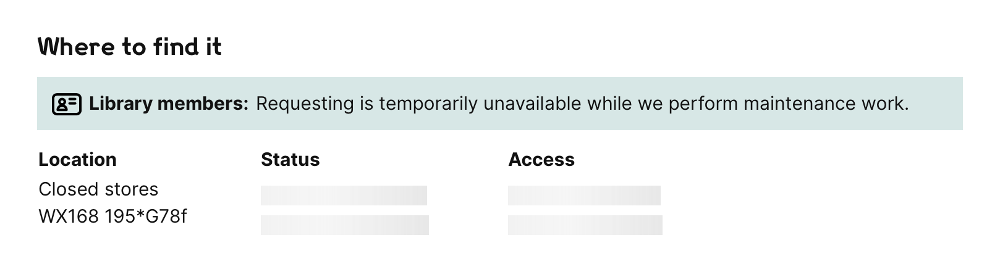

# catalogue

The catalogue web app powers the collections search and work/item viewer.
For example:

-   <https://wellcomecollection.org/works>
-   <https://wellcomecollection.org/works/s42juuaz>
-   <https://wellcomecollection.org/works/k3s3g9um/images?id=uwgw4jwt>

## How to

-   How to [disable requesting](docs/turn-off-requesting.md).
    If we need to disable item requesting temporarily (e.g. for maintenance), we can turn it off on the works page and show a custom message:

    
