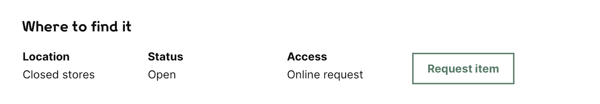
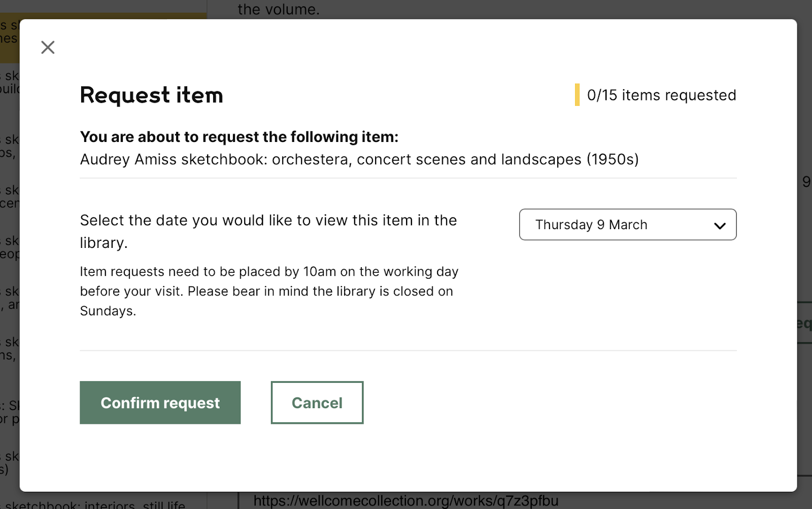
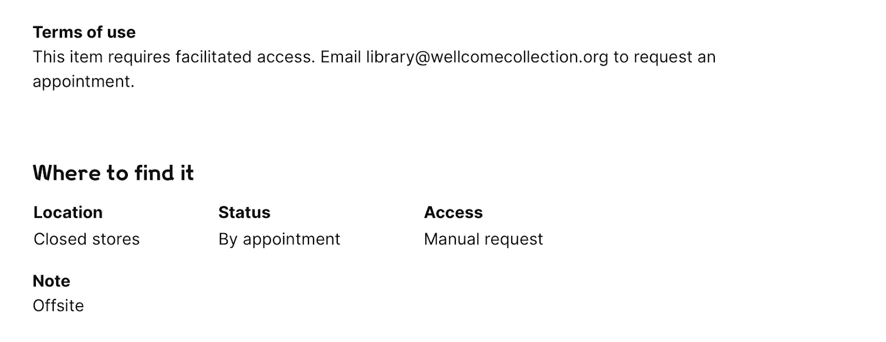
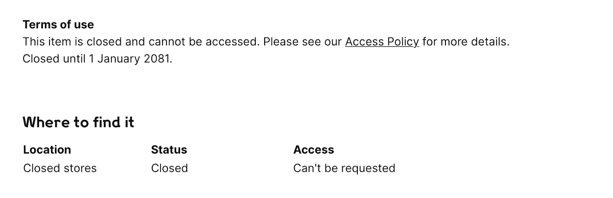

This document is an overview of how users request items. This process is described publicly in the [Accessing our collections](https://wellcomecollection.org/pages/YA64vRMAACAAgRjZ) page on wellcomecollection.org; this document explains what happens behind the scenes.

It’s written from a Digital Platform perspective; although item requesting involves both the Collections & Research (C&R) and Library Experience and Engagement (LE&E) teams, it doesn’t describe their role in detail.

**Epistemic status:** this is a brain dump of everything I (Alex) could think of in early March 2023. We should find a permanent home for this that isn’t Google Docs, and add in bits I’ve forgotten.

# What happens when you request an item?

## A user’s perspective

The majority of our collections are in closed stores, for a variety of reasons, including:

-   They’re fragile
-   They’re bulky or unwieldy
-   The item contains sensitive personal or legal information, and is thus **restricted**

If a user wants to see an item in closed stores, they need to sign up for library membership, then they can request the item for viewing.

Item viewings usually take place in the Rare Materials Room in the library, although occasionally they take place elsewhere by prior arrangement with the reader. (e.g. if a reader wants to see a very large painting, the LE&E team may take the reader down to the painting store rather than move the painting itself.)

Material in closed stores fall into one of three category:

1.  Anybody can request it – items which are open or restricted. For these items, logged-in users see a “Request item” button on the works page.

    

    If a user clicks this button, they’re shown a modal window where they can (1) choose when they’d like to view the item and (2) confirm this is the item they want to request:

    

    A user can then see a list of all the items they’ve requested in their account page on wellcomecollection.org. This will show them what they’ve already requested, and when the item is actually available to view in the Rare Materials Room.

    Once the item appears as available on their account page (or when their selected pickup date arrives), they come into the library and actually view the item.

2.  Anybody can request it, but talk to us first – for example, items which are fragile or bulky. For these items, users have to email Wellcome to arrange access.

    

    All of this is managed entirely by email.

3.  You can’t request it – for example, items which are closed for Data Protection reasons. For these items, we display an explanatory message but users can’t take any action.

    

From a Digital Platform perspective, the most complicated category is (1). We have to render the correct metadata on the page for (2) and (3), but we don’t do any more after that.

## A staff perspective

We’ll focus on case (1) which is the only one that has a significant digital component.

1.  A user clicks the “Request item” button on wellcomecollection.org

    -   What happens in our back-end systems is discussed later in this document

2.  This creates an item request in Sierra (our library management system), and the “Zebra printer” prints a physical slip for this request.

    -   This slip includes the user’s details, the ID of the item they’ve requested, and the date they want to view the item.
    -   The slips are batch printed by staff when they're ready to be processed.

3.  The LE&E team picks up this slip, and moves the item from closed stores to the Rare Materials Room on the appropriate day.

    -   They use the requested pickup date to help prioritise these requests, e.g. items for Monday are moved before items for Friday.
    -   They update the location of the item in Sierra, so anybody else looking for the item in the stores knows why it’s not on the shelf.
    -   The request slip moves with the item – it’s a physical bit of state.

4.  The reader comes to see the item in the RMR. When they’re finished and don’t need to see the item again, the staff supervisor will tear the slip and prepare the item to return to the closed stores.

    -   This is a partial tear, not completely bisecting the slip – it’s a way to indicate “this request has been fulfilled, return it to the stores”

5.  The LE&E team will return the item to the closed stores, remove the item request in Sierra, and discard the physical slip

# Which teams are involved?

The Collections & Research (C&R) and Library Experience & Engagement (LE&E) teams handle parts of the item requesting process, including:

-   Deciding whether an item should be on the open shelves or in closed stores
-   Managing the catalogue metadata about an item, including the access status, access method, and any notes
-   Fetching the item from closed stores and bringing it to the Rare Materials Room, supervising the reader while they’re viewing the item, and returning it to stores

The Digital Platform team build the website component of requesting, and the integrations with the back-end systems, in particular:

-   Rendering the catalogue metadata on the page
-   Creating the online requesting interface, including the “Request item” button and the list of user requests on their account page
-   Making sure that when somebody requests an item, the ticket is available for printing on the Zebra printer

# Can I request [insert item here]? Why? Why not?

We can only request Sierra items with physical locations.

Whether a specific item can be ordered is a complicated combination of rules based on:

-   The location of the item
-   The status and opacmsg fields on the item record (these fields have a fixed set of values, and usually occur in specific combinations)
-   The hold count (non-zero if another user requested this item)
-   The due date (only set if a member of staff has checked out this item)
-   The Sierra rules for requesting (a set of rules in Sierra itself which control whether a particular item can be requested; we maintain a copy of these rules in the platform code)

The output of these rules is an **access condition** on the item in the catalogue API, which includes:

-   An access method (online request, manual request, not requestable, etc.)
-   An access status (open, restricted, closed, and so on based on [our Access Policy §12](https://wellcomecollection.cdn.prismic.io/wellcomecollection/d4817da5-c71a-4151-81c4-83e39ad4f5b3_Wellcome+Collection_Access+Policy_Aug+2020.pdf))
-   Any access notes (e.g. *please email [collections@wellcomecollection.org](mailto:collections@wellcomecollection.org) to book an appointment*)

## Examples of item requesting rules

The exact definition of these rules is the code implementation; it would be impractical to maintain an up-to-date prose document describing their exact state. But to give an idea of how these rules work, here are some examples:

> **Example 1 (an item which is available).** An item with:
>
> -   status `-`/`available`
> -   opacmsg `f`/`online request`
> -   which is in closed stores
> -   which is not blocked by the rules for requesting
>
> would get an access condition with:
>
> -   Access method / `online request`
> -   Access status / `open`
> -   No access notes or terms
>
> **Example 2 (an item at digitisation).** An item with:
>
> -   status `r`/`unavailable`
> -   opacmsg `b`/`at digitisation`
> -   which is marked as unavailable by the rules for requesting
>
> would get an access condition with:
>
> -   Access method / `not requestable`
> -   Access status / `temporarily unavailable`
> -   Access note / `This item is being digitised and is currently unavailable.`
>
> (This access note comes from the platform code, not Sierra.)
>
> **Example 3 (an already-requested item).** An item with:
>
> -   any hold count > 0
>
> would get an access condition with:
>
> -   Access method / `not requestable`
> -   Access status / `temporarily unavailable`
> -   Access note / `Item is in use by another reader. Please ask at Library Enquiry Desk.`
>
> (This message will change to say “You have requested this item” if the item has been requested by the currently logged-in user.)
>
> **Example 4 ([the Audrey Amiss archive](https://wellcomecollection.org/works/jthjhr6c)).** An item with:
>
> -   status h/closed
>
> -   opacmsg u/unavailable
>
> -   which is marked as unavailable by the rules for requesting
>
> would get an access condition with:
>
> -   Access method / `not requestable`
> -   Access status / `closed`
>
> (We also put a “Terms of use” note on the page explaining when it will become available, but this comes from a CALM notes field and not the item data.)

## How do we get the data for the works page?

Item availability information on the works page can come from one of two systems:

-   **The catalogue API.** Whenever an item is updated in Sierra, we process it through the catalogue pipeline. This runs the full set of rules and creates an access condition.

-   **The items API.** There’s latency in the catalogue pipeline, which means there may be a delay between an update in Sierra and this being reflected in the catalogue API. The items API is designed to get the most up-to-date information about an item. It goes back to Sierra for the absolute newest information, creates an access condition, returns the data to the page, and this is what gets rendered.

    e.g. if a user clicks “request item”, we want to mark it as unavailable for all other users immediately – we don’t want to wait for the catalogue API to catch up.

    This is why you sometimes see a loading animation on the items – this is when we’re getting the latest information from Sierra.

    We only call the items API if we think the item might have changed recently, and the catalogue API might be out-of-date. e.g. items which can be requested online, or items which are temporarily unavailable. We skip the items API if the item is unlikely to have changed in the last few minutes, e.g. if it’s closed.

    The items API knows who the logged-in user is, so it can provide user-specific messages. For example *“you have requested this item”* rather than a generic *“this item has been requested by another reader”*.

Unfortunately, we do need both systems:

-   We need the items API to get up-to-date information in the page, especially if there are any problems updating data in the catalogue API.
-   We need the catalogue API to have this access information, so we can filter by access condition and availability.

# Clicking the “Request item” button

## When does the button appear?

This button should only appear if the user can actually request the item – that is, if it has an access method of **Online request** and an **available-ish** access status (which includes Open, Open with advisory, Restricted, but not Temporarily Unavailable or Unavailable).

If the user can’t request the item, the button doesn’t appear on the page – there should be a message or status text explaining why it can’t be requested.

(We experimented with disabled button states, but decided against it – it’s just visual noise on the page, especially for records which are closed or restricted with a long expiry date.)

## What happens behind the scenes when I click it?

When you click the button, it calls the **requests API**. This is an API owned by the platform team.

This API will try to create a **hold record** in Sierra. This record includes the user ID, the item ID, and the requested pickup date. (Not a checkout record – although that might be a better fit for what we’re doing, for historical reasons we use hold records to track item requests.)

If the Sierra API successfully creates a record, the user gets a success message, and a ticket gets printed on the Zebra printer. At this point LE&E takes over handling the request.

If the Sierra API fails to create a record, the requests API will try to create a useful user-facing error message (e.g. “you are at your request limit”).

# Possible future improvements

These aren’t all things we will do, but they’re ideas we’ve discussed in the past.

## Eradicate manual request process

Some of the collections are only requestable through a manual process which relies on triplicate slips (green slips) in the library. These materials include anything held off-site, including catalogued and uncatalogued materials, and some on-site materials like journals. Essentially, anything that isn’t itemised is a manual request.

We would like to reduce the manual processing effort that happens within the library teams, and make more of our collections requestable online. 

This work has been agreed with C&R to begin in Q3 2023. 

## Simplify the item availability rules

The complexity of this logic stems from the complexity of the underlying data; there are lots of different combinations of status/opacmsg/location in use, all of which are expected to behave in a particular way. If we could reduce the number of combinations, we could simplify the rules.

I think DE/C&R would both like to see this get simpler, but that’s easier said than done.

On the DE side: we’d like a better way to highlight invalid data to C&R, e.g. through a dashboard which is automatically populated; currently all our data cleanup requests are ad hoc and manual. This is a larger bit of work, which would benefit many areas including item requesting.

## Improve the experience for staff

Staff can do things that members of the public can’t:

1.  They can request items which aren’t publicly available; this breaks their account page on wellcomecollection.org, because we assume that all requested items are in the public catalogue. See <https://github.com/wellcomecollection/wellcomecollection.org/issues/8781>

2.  They can check out items from the library

We know staff are hitting this problem, because we see the errors in the #wc-platform-alerts channel on a regular basis. There’s a proposed fix in ticket #8781, but it hasn’t been prioritised in planning (yet).

## Retain the context of where the user found the item

A single item can be attached to multiple works. e.g. if we have a book of postcards, each postcard might have an individual work which is linked to the same item (the overall book). This means we can get the following scenario:

1.  A user is looking at a work “person on beach”, which has the item on the page
2.  The user requests the item
3.  Later, the user looks at their list of requested items
4.  It links to a completely different work “book of postcards”
5.  User is now confused

This is because Sierra just remembers the item that was requested, and doesn’t know that it came from a works page (or which works page). When we get the list of items back, we have to guess which works page the user was looking at.

We have some of the back-end pieces in place to support linking to the original works page where a user found the item, but they’re not fully connected yet.

## Provide an online version of the Restricted Access form

When a reader wants to see restricted material in the library, they have to fill in a restricted access request form agreeing to certain conditions, e.g. that they won’t copy the material. This form is retained by C&R; it allows them to audit all access to restricted material.

Currently this is a paper form filled in by readers when they visit the RMR; it might be useful to allow readers to complete this as part of their online request. 

## Provide reporting on user requests

It would be useful to provide reporting and analytics on what items are being requested, for example:

-   How many items are being requested?
-   Which collections are being requested most frequently?
-   How many readers are requesting material which is already digitised?

This might inform, say, decisions about which items are kept on-site or off-site. There is some reporting like this already, but it’s somewhat ad hoc – because the platform now handles all requesting on the public website, it could provide these statistics in a complete and privacy-preserving way.

There’s already [a design proposal](https://github.com/wellcomecollection/platform/issues/5208) for the technical implementation, but it needs user research and analyst input, e.g. what sort of questions do we want to ask of this system? This is a moderately large project and would likely need to go through quarterly planning.

## Provide a history of item requests

It might be useful for users to know what items they’ve requested in the past, but we don’t provide this feature. Once an item is returned in the RMR, it disappears from their account.

As far as we know, because we use hold records to track item requests in Sierra, there’s no easy way to track this in Sierra itself. (In lending libraries that use Sierra, a reader gets a “hold” when they reserve an item, and a “checkout” when they actually collect the item. Sierra records a checkout history, but not a hold history.)

We’d have to track this history ourselves. Since we consider somebody’s item request history to be personally identifiable information, we need to treat it carefully; currently our only persistent store of PII is Sierra itself.

This is achievable, but needs careful planning.

## Allow requesting items from systems other than Sierra

Currently we can only request items from Sierra, but the back-end systems have been designed with extensibility in mind. The catalogue and items APIs are both generic and not Sierra-specific, and internally there are hooks to support requesting items from other systems, such as CALM or some future Sierra replacement.

In practice this would be a very substantial piece of work to build integrations with a new back-end, and would need heavy involvement with LE&E to design the associated processes.

It’s possible for when we eventually replace Sierra, but would likely need multiple years of planning.

# Appendix

## Acronyms

<dl>
  <dt>C&R</dt>
  <dd>Collections & Research, a team at Wellcome</dd>

  <dt>LE&E</dt>
  <dd>Library Experience & Engagement, a team at Wellcome</dd>

  <dt>OPAC</dt>
  <dd>Online Public Access Catalogue, which is both a generic term for an online library catalogue and a nickname for the website at catalogue.wellcomelibrary.org (only available to staff on the corporate network)</dd>

  <dt>RMR</dt>
  <dd>Rare Materials Room</dd>
</dl>

## Related documents

-   [Accessing our collections](https://wellcomecollection.org/pages/YA64vRMAACAAgRjZ) on wellcomecollection.org
-   [Archives at Wellcome Collection](https://wellcomecollection.org/guides/YL9OAxIAAB8AHsyv) on wellcomecollection.org
-   The [Wellcome Collection Access Policy](https://wellcomecollection.cdn.prismic.io/wellcomecollection/d4817da5-c71a-4151-81c4-83e39ad4f5b3_Wellcome+Collection_Access+Policy_Aug+2020.pdf)
-   [Requesting and registration project document (Miro board)](https://miro.com/app/board/o9J_lKrHIws=/?share_link_id=892112807037)
-   [User research findings](https://proficient-wallaby-dpwd.dovetailapp.com/projects/4a9BmxhJG36l52PKMBKSRv/readme) (Dovetail)
-   [Service blueprint - offsite requesting](https://docs.google.com/spreadsheets/d/1U3RTwngJwBq-kvl7u92CxIuOFmmbPYblDWFgW9PChB0/edit#gid=0)