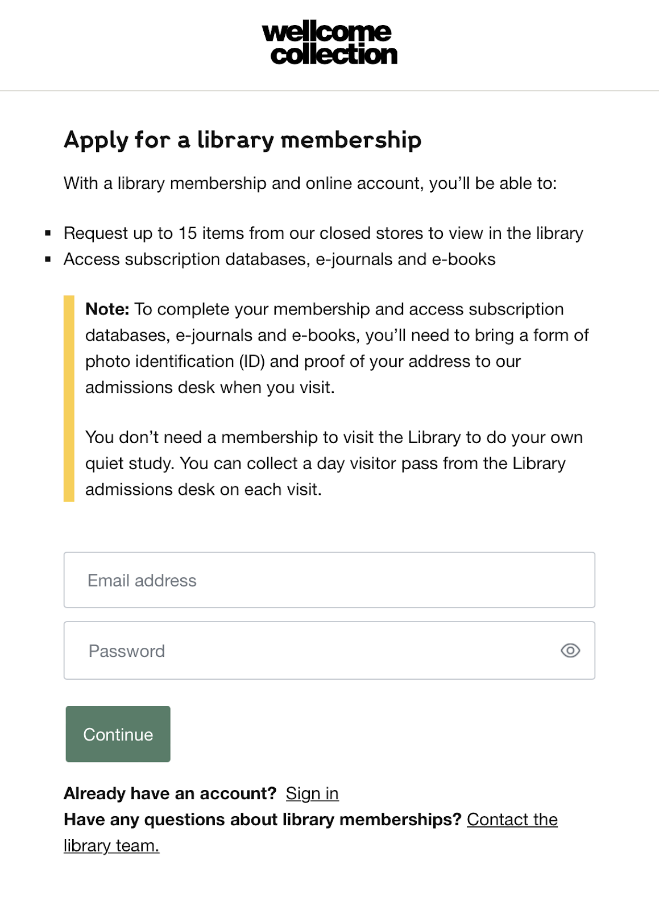
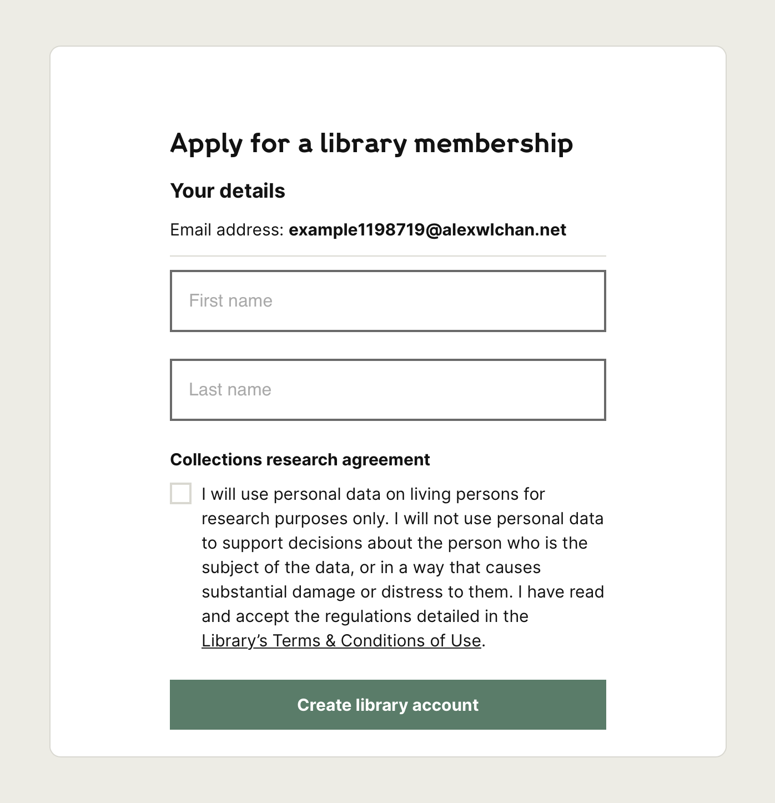
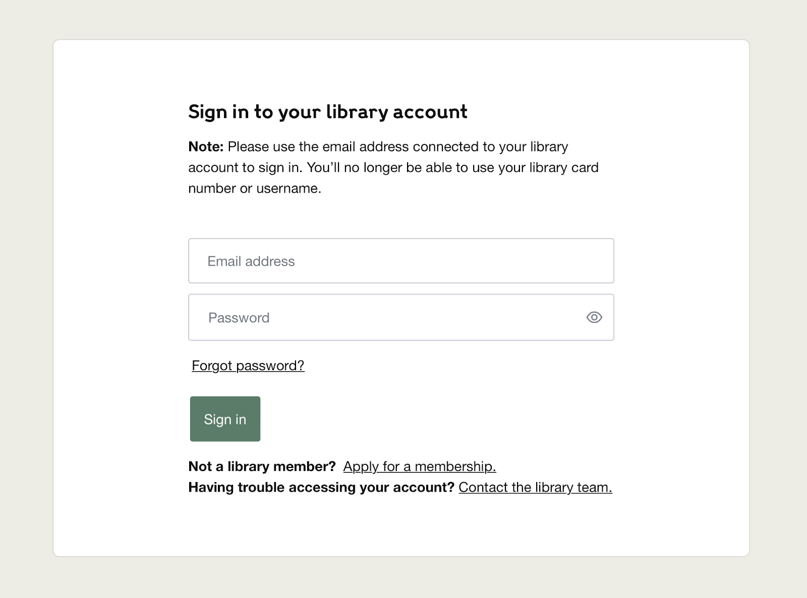
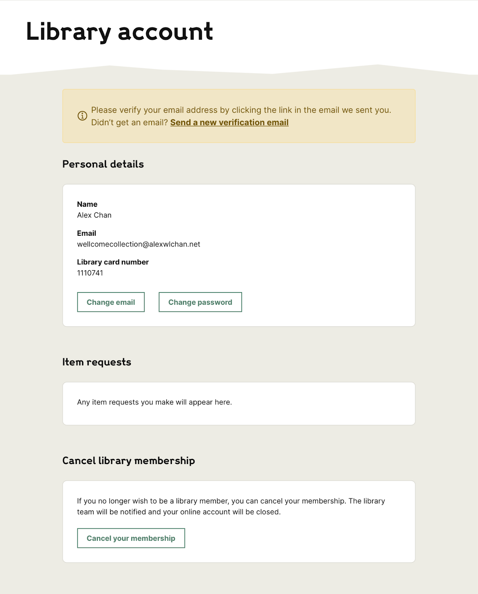
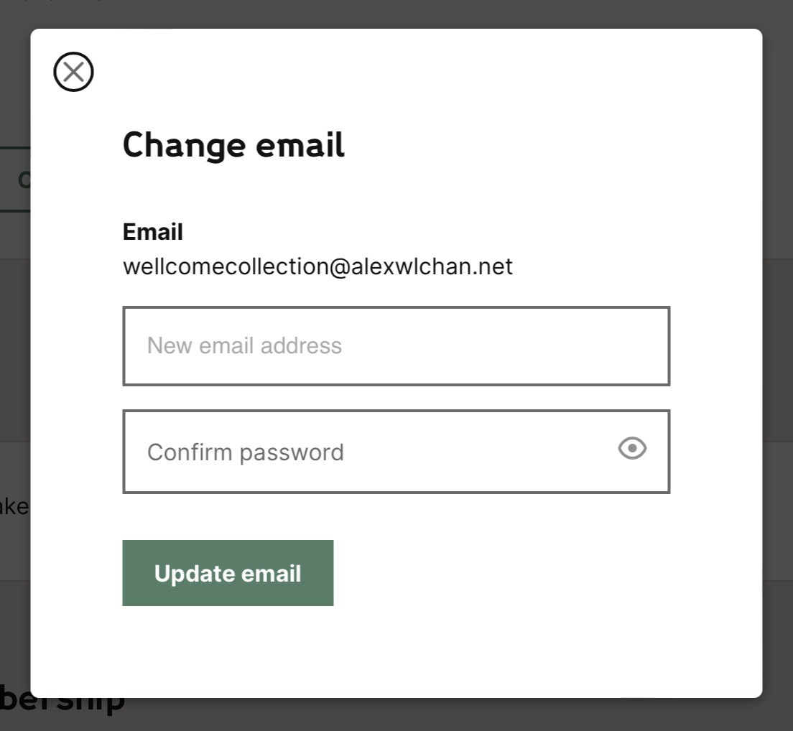
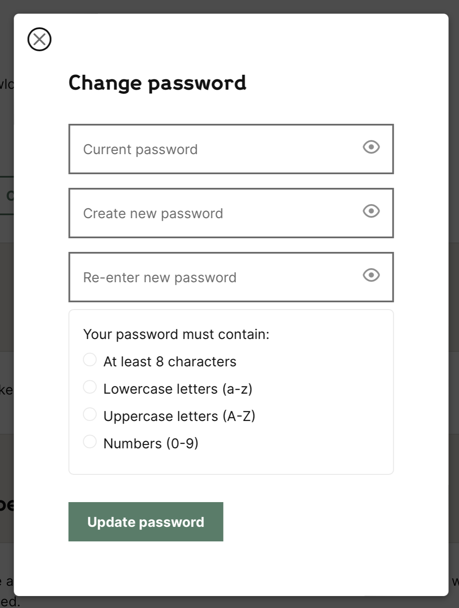
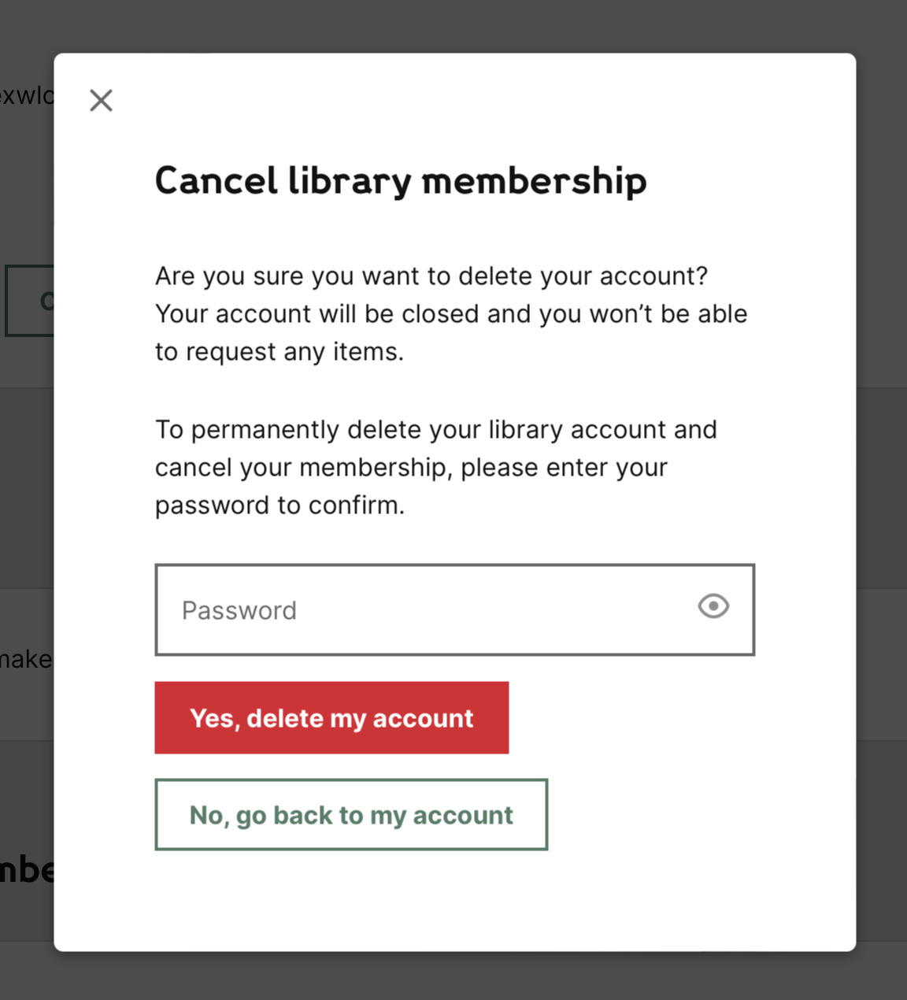

This document is an overview of how we manage library membership. This process is described publicly in the [Library membership](https://wellcomecollection.org/collections/library-membership) page on wellcomecollection.org; this document explains what happens behind the scenes.

It’s written from a Digital Platform perspective; although membership also involves the Library Experience and Engagement (LE&E) team, it doesn’t describe their role in detail.

**Epistemic status:** this is a brain dump of everything I (Alex) could think of in early March 2023.

# What is membership for?

Quoting from the [Library membership page](https://wellcomecollection.org/collections/library-membership) on wellcomecollection.org:

> [Membership] allows you to:
>
> -   order items from the library’s closed stores to view in our Rare Materials Room 
> -   log in to the library’s computer network to access our online [subscription databases](https://wellcomecollection.org/collections/databases)
> -   use the library scanners and printers for research purposes 
> -   [book a study room](https://wellcomecollection.org/collections/study-rooms).

Ordering items from the closed stores is the item requesting process, which is [described separately](https://docs.google.com/document/d/1WXK79lGKp0pbO_7O5p_10uNFIvSbiPBaRS4Q_JSAc50/edit#).

Users access online subscription databases (e.g. online journals) using a third-party service called **OpenAthens**. When users try to access subscription resources, they are directed to log in to their library account before they can see anything. This is managed by the Collection Systems Support team (formerly Library Systems Support).

The Digital Platform team isn’t involved with library scanners and printers, nor booking study rooms.

# What does it look like for users?

## Signing up as a new member

If they're at home, a new member can sign up by going to <https://wellcomecollection.org/signup>.

If they're in the library, a new member has two options (quoting LE&E):

> Preferably, we will ask them to pre-register on their own device or by popping them in to use the quick access PC's in the Library. They would then come back to the desk soon after to give us the extra info we need for their account by paper form; show ID and then we print the card.  If they do not have their own device or do not feel confident with doing things online, they can use the paper form. It does mean that we need to generate a password re-set link for their account, so that they can activate their account and email correctly.

The online form includes a brief explanation of what library membership includes, and asks them for an email address and password:

On the next screen, the user is asked to give us some personal information – currently just their name and the collections research agreement:

They are required to fill in this information – if they walk away and try to log in again later, they will keep returning to this screen until it’s completed.

Once they fill in this screen, the sign-up process is complete. They can now request items to view in the library, but when they visit the library they’ll have to bring photo ID and proof-of-address to get a physical library card printed and complete their membership.

We have plans to improve this screen, by adding more fields – see "future improvements" below.

**Implementation note:** you may wonder why we split the sign-up form over two separate screens; this is a limitation of our identity provider (Auth0). We can’t add extra fields to the email/password signup screen; we can only customise the text. The second form is fully custom, and we can add as many fields or as much logic as we like.

## Logging in to your account

Users can log in to their account using the account link in the top-right hand corner of the global nav, or from the link to “log in to request items” which appears on work pages.

The sign-up form is pretty standard: email, password, forgot password link:

**Implementation note:** the previous sign-in form allowed users to sign in with their email address, library card number, or username; hence the note above the current form. At some point we should remove this note.

Once somebody logs in, they go to their library account page, which includes personal information, a list of any pending item requests, and an option to request cancellation of their library membership.

If you click “Change email” or “Change password”, a modal window appears that asks you to enter your new details (and requires your current password to confirm).

If you click “Cancel your membership”, a modal window appears explaining what will happen, asks you to enter your password, and then has a Confirm/Cancel step.

  

Implementation notes:

-   We ask users to verify their email address upon sign-up; they can request a new verification email from the yellow banner. We record email address verifications in Sierra, and if somebody changes their email address, we ask them to verify again.

-   We deliberately don’t allow users to change their name online. This is a policy decision, so that people don't change their names without us knowing about it, mainly for the benefit of RMR staff and their record of who has used what material previously.

    There are also technical limitations – changing names is moderately fiddly for us to achieve in a “good” way because of how we pass data around.

-   Clicking “cancel your membership” doesn’t delete the user’s data immediately; it kicks off the LE&E account deletion process. In particular:

-   The user’s account gets blocked, so they can’t log in any more.

-   An email gets sent to [library@wellcomecollection.org](mailto:library@wellcomecollection.org) telling them “The user with ID 1234567 has submitted a request to have their account deleted.”

-   An email gets sent to the user telling them “We've received your request to delete your library account. A member of the team will review and action this within the next 7 days.”

# What do we do with user data?

Information about library members includes personally identifiable information (PII) which is protected by GDPR. This includes the standard stuff, like:

-   Name
-   Email address
-   Password
-   Home address (collected when they visit the library in-person)

For our purposes, we also treat certain library-specific information as private, and treat it with the same level of sensitivity. This includes:

-   Any item requests the member has made, past or present

## Sierra is the canonical store of users

Sierra is the canonical store of data about library members (in Sierra this is called “patron records”). This was an intentional choice when we built the new membership services on wellcomecollection.org:

-   Sierra is already approved as a database that holds PII
-   The LE&E team are already familiar with Sierra as a management interface for library members
-   Reusing Sierra meant we didn’t have to change any LE&E processes

## Auth0 is an identity provider that sits in front of Sierra

Auth0 is a third-party identity provider that manages our authentication – in particular, it powers our sign-up and sign-in pages, and tells our code when a user successfully authenticates. (You may notice those pages are hosted on account.wellcomecollection.org – this means they’re run by Auth0, not us.)

Auth0 are responsible for protecting those pages from certain forms of attack, e.g. brute force password attacks or a DDOS. They can do a better job of securing those pages than we can on our own.

Auth0 contains a cache of user information from Sierra, including names and email addresses.

## The identity APIs are interfaces to the data in Sierra

The identity APIs perform actions on behalf of the user, including:

-   Creating new item requests
-   Retrieving a list of current item requests
-   Requesting deletion of their account

The identity APIs are stateless and don’t hold any user data.

## User roles (staff, reader, self-registered, etc)

Each library member has a patron record in Sierra; each patron record has a patron type. Sierra has a long list of patron types, e.g. reader, student, Wellcome Trust staff, Photography, Conservation.

In Auth0, each user gets a role, which is chosen based on their patron type. The four possible roles are:

-   Self-registered
-   Reader
-   Staff
-   Excluded

When a user initially signs up, they get the “self-registered” role. This allows them to request items from the closed stores, but not access subscription resources. Only users with the “reader” role can access those resources; a user gets the reader role when they visit the library in-person and provide ID/proof of address to the LE&E staff.

A user gets the staff role if they have any of the staff-related patron types in Sierra.

The “excluded” role comes directly from a Sierra patron type of the same name.

## How users get deleted

When a user requests an account deletion, the LE&E team delete the record in Sierra. The Collections System Support team will also batch delete records annually, when accounts expire.

We have automated processes to flush deleted users from the cache of user information in Auth0.

## User data is kept in a dedicated AWS account

Auth0 is a standalone service, and the identity APIs run in a dedicated AWS account, away from our other services (e.g. the public website, the catalogue pipeline).

# Next steps (aka “Phase 2”)

The library membership work (and sign-up in particular) was originally envisaged in three phases:

-   Phase 1: Migrate the previous form on wellcomelibrary.org to wellcomecollection.org
-   Phase 2: Look at how to capture additional data fields, e.g. address
-   Phase 3: Look at aligning the offline experience

So far we’ve only completed phase 1; this became sufficiently complicated to implement that we had to defer any development work on later phases.

We've also discussed the possibility of outsourcing ID checks to a service like [Stripe Identity](https://stripe.com/gb/identity), but that's a much longer-term plan.

There has already been some design work to look at what phases 2 and 3 might involve, e.g. <https://github.com/wellcomecollection/wellcomecollection.org/issues/7648>

# Background information

- [Requesting and registration project document (Miro board)](https://miro.com/app/board/o9J_lKrHIws=/?share_link_id=892112807037) 
- [User research findings](https://proficient-wallaby-dpwd.dovetailapp.com/projects/4a9BmxhJG36l52PKMBKSRv/readme) (Dovetail)
