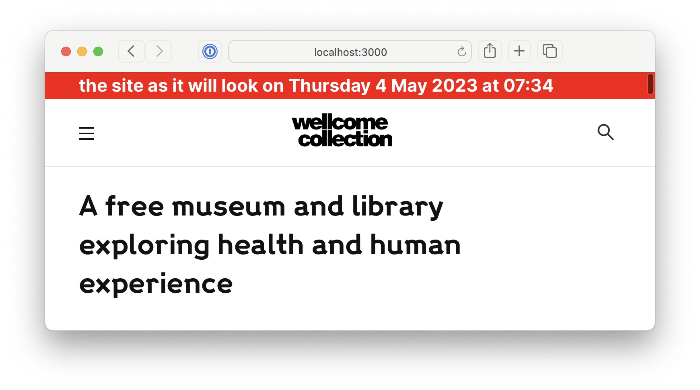

Datetime logic is fiddly and we don't always get it right.

To help us test date logic, you can make the site think it's running at a particular date/time, rather than "right now" – for example, you could make it think it's the final day of an exhibition, and test how it behaves.

1.  Change the return value of `today()` in @weco/common/utils/dates to return the value of the time you want to simulate: https://github.com/wellcomecollection/wellcomecollection.org/blob/main/common/utils/dates.ts#L4-L19

2.  Add a debugging snippet somewhere on the page that reports the current value of today(), e.g. add the following to the top of the PageLayout component:

    ```typescript
    import { formatDayDate, formatTime } from '@weco/common/utils/format-date';
    import { today } from '@weco/common/utils/dates';
    import { Container } from '@weco/common/views/components/styled/Container';

    …

    <Container
      style={{
        background: 'red',
        fontSize: '1.2em',
        color: 'white',
        fontWeight: 'bold',
      }}
    >
      the site as it will look on {formatDayDate(today())} at{' '}
      {formatTime(today())}
    </Container>
    ```



Where you put this banner isn't hugely important, as it's just for debugging – but if you want to capture any screenshots as evidence for your testing, having this visible makes it much easier to understand them later.
