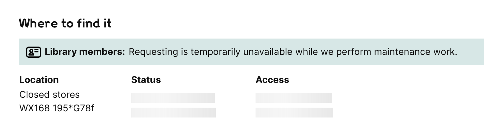

## How to disable requesting

If we need to disable item requesting temporarily (e.g. for maintenance), we can turn it off on the works page and show a custom message:



1.  Update the message in [the microcopy file](https://github.com/wellcomecollection/wellcomecollection.org/tree/main/common/data).
    At time of writing (August 2022), it's a variable called `requestingDisabled`.

2.  Push your change to GitHub; deploy the update.
    This will take some time, so ideally deploy the change in advance of when you want to disable requesting.

3.  When you're ready to disable requesting, turn on the `disableRequesting` toggle.

    In the [`toggles/webapp` directory](https://github.com/wellcomecollection/wellcomecollection.org/tree/main/toggles/webapp), run:

    ```console
    $ yarn setDefaultValueFor --disableRequesting=true
    ```

4.  When you're ready to re-enable requesting, run this command:

    ```console
    $ yarn setDefaultValueFor --disableRequesting=false
    ```
