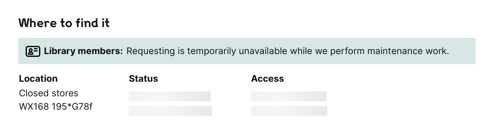

## How to disable requesting

If we need to disable item requesting temporarily (e.g. for maintenance), we can turn it off on the works page and show a custom message:



1.  Update the message in [the microcopy file](https://github.com/wellcomecollection/wellcomecollection.org/tree/main/common/data).
    At time of writing (August 2022), it's a variable called `requestingDisabled`.

2.  Push your change to GitHub; deploy the update.
    This will take some time, so ideally deploy the change in advance of when you want to disable requesting.

3.  When you're ready to disable requesting, turn on the `disableRequesting` toggle.

    In the [`toggles/webapp` directory](https://github.com/wellcomecollection/wellcomecollection.org/tree/main/toggles/webapp), run:

    ```console
    $ yarn setDefaultValueFor --disableRequesting=true
    ```

    This updates `toggles.json` in S3 and invalidates it in CloudFront.

4.  Wait for the webapps to pick up the new value.

    Each running webapp task re-reads `toggles.json` once a minute on its own timer. Wait a couple of minutes, then check what the origin is rendering by adding a throwaway query string, which skips the CloudFront cache:

    ```console
    $ curl -s "https://wellcomecollection.org/works/rp9jnamu?cb=$(date +%s)" | grep -o '"disableRequesting":[a-z]*'
    "disableRequesting":true
    ```

    Don't move on until this shows the new value. If you invalidate the cache while a task is still rendering the old value, CloudFront caches that page again for another hour.

5.  Invalidate the cached work pages.

    CloudFront caches work pages for up to an hour, and the toggle value is baked into the cached HTML. Without this step, any work page someone viewed in the last hour keeps showing the sign-in link and Request button until its cache entry expires.

    You need a role that can create CloudFront invalidations in the experience account. `setDefaultValueFor` uses `experience-admin` for its own invalidation of `toggles.json`. The first command looks up the production distribution by its alias (it is also the `wc_org_cf_distro_id` Terraform output in `cache/`):

    ```console
    $ DISTRIBUTION_ID=$(AWS_PROFILE=experience-admin aws cloudfront list-distributions --query "DistributionList.Items[?contains(Aliases.Items, 'wellcomecollection.org')].Id" --output text)
    $ AWS_PROFILE=experience-admin aws cloudfront create-invalidation --distribution-id "$DISTRIBUTION_ID" --paths "/works/*" "/_next/data/*"
    ```

    `/_next/data/*` covers the JSON that client-side navigation between works fetches instead of full pages. These two paths also clear the item viewer pages and the data JSON for every other page on the site, so expect the webapps to handle more requests than usual while the cache refills.

6.  Check it has taken effect. Open a work with a physical item, for example [rp9jnamu](https://wellcomecollection.org/works/rp9jnamu), in a private browsing window, this time without a query string so that you get the CloudFront copy. It should show the banner, and the page source should contain `"disableRequesting":true`.

    Browsers also keep work pages for up to an hour and the invalidation can't clear those copies. Someone who opened a work shortly before the change can still see the Request button on that page until their browser's copy expires.

7.  When you're ready to re-enable requesting, run this command, then repeat steps 4 to 6, expecting `false` this time:

    ```console
    $ yarn setDefaultValueFor --disableRequesting=false
    ```

`toggles.json` is shared across environments, so www-stage follows the same toggle. Stage has its own CloudFront distribution (the `stage_wc_org_cf_distro_id` Terraform output), so its work pages switch over gradually during the following hour unless you invalidate that distribution too.
